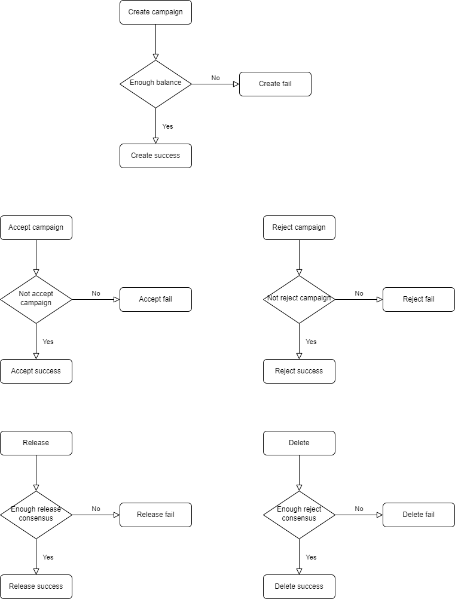

# CampaignManagement
## Flow 



## Variables

### \_token

<p style="white-space: pre;">
    ERC20 token address
<p>

```solidity
  IERC20 public _token
```

### \_campaignNames

<p style="white-space: pre;">
    List campaign name
<p>

```solidity
  string[] private _campaignNames
```

### \_datas

<p style="white-space: pre;">
    List token unlock by time
<p>

```solidity
   DataByTime[] private _datas
```

### \_campaigns

<p style="white-space: pre;">
    Mapping campaign name to campaign struct
<p>

```solidity
  mapping(string => Campaign) private _campaigns
```

### campaignConsents

<p style="white-space: pre;">
    The consent of the address is admin to an campaign
<p>

```solidity
  mapping(string => mapping(address => AdminConsentStatus))
    public campaignConsents
```

### \_participants

<p style="white-space: pre;">
  all participant join campaign
<p>

```solidity
  mapping(address => bool) public _participants
```

---

## Modifiers

### `enoughReleaseConsensus()`

<p style="white-space: pre;">
    require: accept count is greater than 50% account consensus than total admins
<p>

```solidity
  enoughReleaseConsensus(string memory campaignName)
```

### `enoughDeleteConsensus()`

<p style="white-space: pre;">
    require: reject count is greater than 50% account consensus than total admins
<p>

```solidity
  enoughDeleteConsensus(string memory campaignName)
```

### `confirmedRelease()`

<p style="white-space: pre;">
    require sender confirmed campaign
<p>

```solidity
  confirmedRelease(string memory campaignName)
```

### `notConfirmedRelease()`

<p style="white-space: pre;">
    require sender didn't confirmed campaign
<p>

```solidity
  notConfirmedRelease(string memory campaignName)
```

### `isExist()`

<p style="white-space: pre;">
    require campaign is exist
<p>

```solidity
  isExist(string memory campaignName)
```

## Functions

### `constructor()`

<p style="white-space: pre;">
   make msg.sender become admin
<p>

```solidity
  constructor(
    IERC20 token_,
    uint256[] memory times_,
    uint256[] memory amounts_
  )
```

### `createCampaign()`

<p style="white-space: pre;">
   require campaignName not exits
   require accounts and amounts have long as together
<p>

```solidity
    createCampaign(
    string memory campaignName,
    address[] memory accounts,
    uint256[] memory amounts,
    uint256 releaseTime
  ) public override onlyAdmin nonReentrant isExist(campaignName)
```

#### Parameters list:

| Name           | Type      | Description      |
| :------------- | :-------- | :--------------- |
| `campaignName` | string    | name of campaign |
| `accounts`     | uint256[] | address          |
| `amounts`      | uint256[] | amount           |
| `releaseTime`  | string    | release time     |

### `adminAcceptRelease()`

<p style="white-space: pre;">
    require account not accept release this campaign
<p>

```solidity
    adminAcceptRelease(string memory campaign)
    public
    override
    onlyAdmin
    notConfirmedRelease(campaign)
```

#### Parameters list:

| Name       | Type   | Description   |
| :--------- | :----- | :------------ |
| `campaign` | string | campaign name |

### `adminRejectRelease()`

<p style="white-space: pre;">
    require account not reject release this campaign
<p>

```solidity
    adminRejectRelease(string memory campaign)
    public
    override
    onlyAdmin
    confirmedRelease(campaign)
```

#### Parameters list:

| Name       | Type   | Description   |
| :--------- | :----- | :------------ |
| `campaign` | string | campaign name |

### `release()`

<p style="white-space: pre;">
    require enough accept consensus
<p>

```solidity
    release(string memory campaignName, bool passive)
    public
    override
    onlyAdmin
    enoughReleaseConsensus(campaignName)
```

#### Parameters list:

| Name           | Type   | Description          |
| :------------- | :----- | :------------------- |
| `campaignName` | string | campaign name        |
| `passive`      | bool   | passive or proactive |

### `deleteCampaign()`

<p style="white-space: pre;">
    require enough reject consensus
<p>

```solidity
    deleteCampaign(string memory campaignName)
    public
    override
    onlyAdmin
    enoughDeleteConsensus(campaignName)
```

#### Parameters list:

| Name           | Type   | Description   |
| :------------- | :----- | :------------ |
| `campaignName` | string | campaign name |

### `getDatas()`

<p style="white-space: pre;">
    get data set in constructor
<p>

```solidity
   getDatas() public view override returns (DataByTime[] memory)
```

### `getCampaigns()`

<p style="white-space: pre;">
    get all campaign name
<p>

```solidity
    getCampaigns() public view override returns (string[] memory)
```

### `getCampaign()`

<p style="white-space: pre;">
    get detail by campaign name
<p>

```solidity
    getCampaign(string memory campaignName)
    public
    view
    override
    returns (Campaign memory)
```

### `getTotalTokenUnlock()`

<p style="white-space: pre;">
    get token unlock by time
<p>

```solidity
    getTotalTokenUnlock() public view override returns (uint256)
```

### `getTokenCanUse()`

<p style="white-space: pre;">
    token can use for campaign
<p>

```solidity
    getTokenCanUse() public view override returns (uint256)
```

### `getConsensusByNameAndStatus()`

<p style="white-space: pre;">
    get total consensus of campaign by status
<p>

```solidity
    getConsensusByNameAndStatus(
    string memory campaignName,
    AdminConsentStatus status
  ) public view override returns (uint256)
```

### `getTokenUsed()`

<p style="white-space: pre;">
    get token used for campaign
<p>

```solidity
    getTokenUsed() public view override returns (uint256)
```
