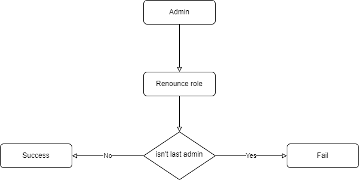

# AdminConsensus
## Flow 




## Variables

### \_admins

<p style="white-space: pre;">
    Variable for save list address
<p>

```solidity
  address[] internal _admins
```

### isAdmin

<p style="white-space: pre;">
    Mapping address to admin(true) or not(false)
<p>

```solidity
  mapping(address => bool) public isAdmin
```

### adminConsents

<p style="white-space: pre;">
    The consent of the address is admin to an address
<p>

```solidity
  mapping(address => mapping(address => ConsentStatus)) public adminConsents
```

---

## Modifiers

### `onlyAdmin()`

<p style="white-space: pre;">
    require msg.sender have role admin
<p>

### `notAdmin()`

<p style="white-space: pre;">
    require address haven't role admin
<p>

```solidity
  notAdmin(address account)
```

### `hasRoleAdmin()`

<p style="white-space: pre;">
    require address have role admin
<p>

```solidity
  hasRoleAdmin(address account)
```

### `confirmed()`

<p style="white-space: pre;">
    require unconfirmed sender
<p>

```solidity
  confirmed(address account)
```

### `notConfirmed()`

<p style="white-space: pre;">
    require confirmed sender
<p>

```solidity
  notConfirmed(address account)
```

### `enoughAcceptConsensus()`

<p style="white-space: pre;">
    before: msg.sender accept this account.
    require: consensus of account is greater than 50% account consensus than total admins
    after: reset consensus of account 
<p>

```solidity
  enoughAcceptConsensus(address account)
```

### `enoughRevokeConsensus()`

<p style="white-space: pre;">
    before: msg.sender accept this account.
    require: consensus of account is greater than 50% account consensus than total admins minus 1 (address revoked)
    after: reset consensus of account 
<p>

```solidity
  enoughRevokeConsensus(address account)
```

---

## Functions

### `constructor()`

<p style="white-space: pre;">
   make msg.sender become admin
<p>

```solidity
  constructor () public
```

### `addAdmin()`

<p style="white-space: pre;">
   make account become admin
   require account not a admin and enough consensus
<p>

```solidity
    addAdmin(address account) public
    override
    onlyAdmin
    enoughAcceptConsensus(account)
    notAdmin(account)
```

#### Parameters list:

| Name      | Type    | Description |
| :-------- | :------ | :---------- |
| `account` | address | address     |

### `renounceAdminRole()`

<p style="white-space: pre;">
    msg.sender renounce role
    require msg.sender has admin role
<p>

```solidity
    renounceAdminRole() public override onlyAdmin
```

### `revokeAdminRole()`

<p style="white-space: pre;">
    revoke admin role of account
    require account is a admin and enough consensus
<p>

```solidity
    revokeAdminRole(address account)
    public
    override
    onlyAdmin
    enoughRevokeConsensus(account)
    hasRoleAdmin(account)
```

#### Parameters list:

| Name      | Type    | Description |
| :-------- | :------ | :---------- |
| `account` | address | address     |

### `adminAccept()`

<p style="white-space: pre;">
    msg.sender accept account
<p>

```solidity
    adminAccept(address account)
    public
    override
    onlyAdmin
    notConfirmed(account)
```

### `adminReject()`

<p style="white-space: pre;">
    msg.sender reject account
<p>

```solidity
    adminAccept(address account)
    public
    override
    onlyAdmin
    notConfirmed(account)
```

#### Parameters list:

| Name      | Type    | Description |
| :-------- | :------ | :---------- |
| `account` | address | address     |

### `getAdminConsensusByAddressAndStatus()`

<p style="white-space: pre;">
    get account consensus number by status
<p>

```solidity
    getAdminConsensusByAddressAndStatus(
    address account,
    ConsentStatus status
  ) public view override returns (uint256)
```

#### Parameters list:

| Name      | Type          | Description |
| :-------- | :------------ | :---------- |
| `account` | address       | address     |
| `status`  | ConsentStatus | 0,1,2       |

### `getAdmins()`

<p style="white-space: pre;">
    get list address have admin role
<p>

```solidity
    getAdmins() public view override returns (address[] memory)
```
